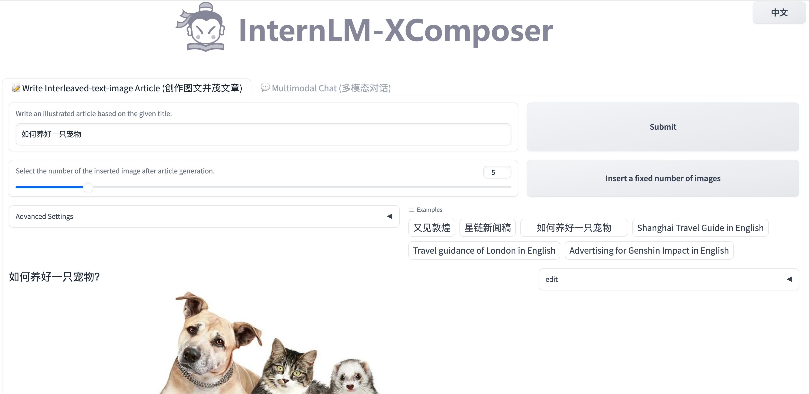

一、基础作业：
1、使用 InternLM-Chat-7B 模型生成 300 字的小故事（需截图）。
进入虚拟环境：

使用命令行对话方式：

2、熟悉 hugging face 下载功能，使用 huggingface_hub python 包，下载 InternLM-20B 的 config.json 文件到本地（需截图下载过程）。
设置环境变量，安装相应的包

运行download.py脚本进行下载

下载结果

二、进阶作业（可选做）
1、完成浦语·灵笔的图文理解及创作部署（需截图）

2、完成 Lagent 工具调用 Demo 创作部署（需截图）

