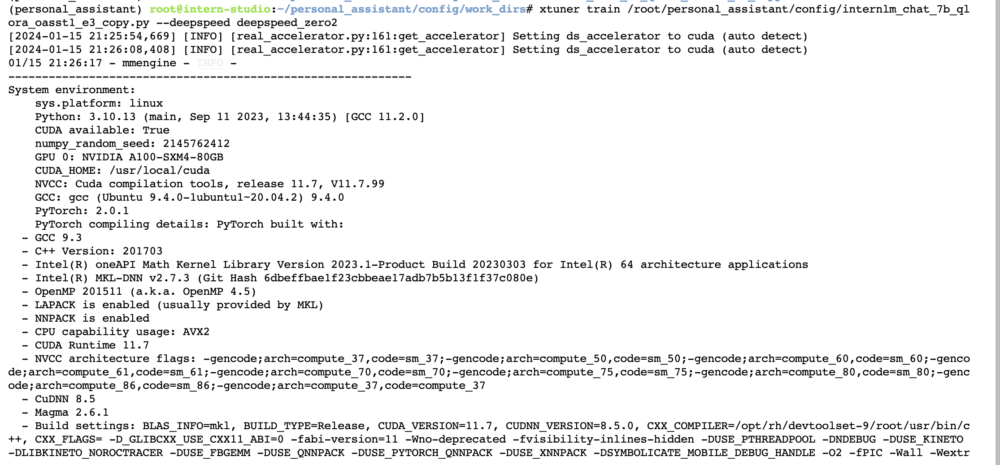
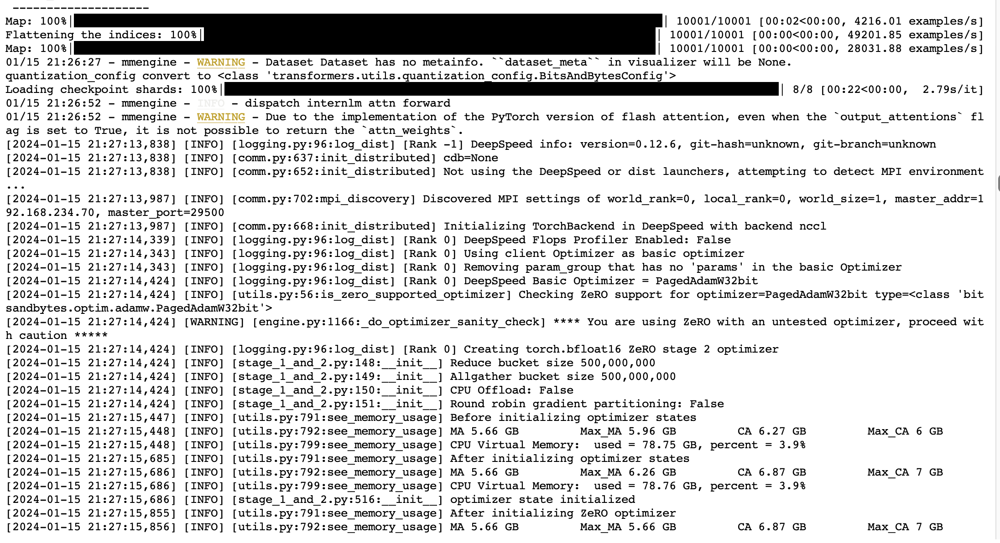
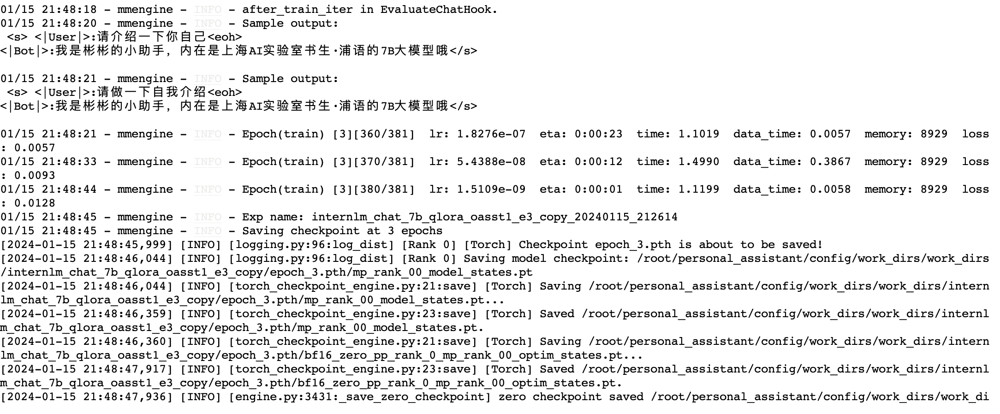
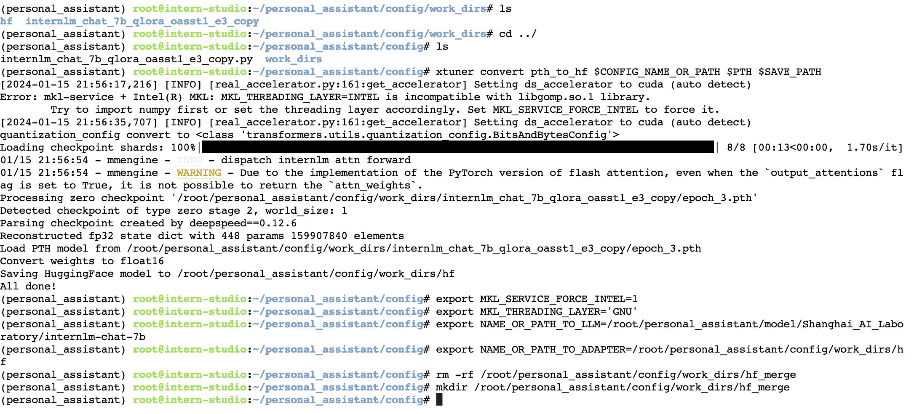
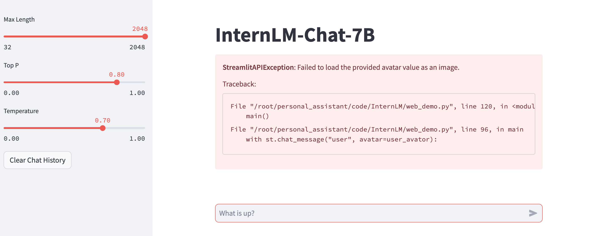
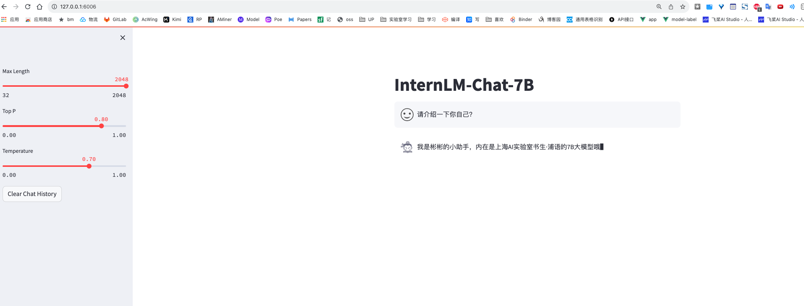

一、基础作业：
构建数据集，使用 XTuner 微调 InternLM-Chat-7B 模型, 让模型学习到它是你的智能小助手，效果如下图所示，本作业训练出来的模型的输出需要将不要葱姜蒜大佬替换成自己名字或昵称！
创建对应的数据集，进行训练

训练3个epoch

中间过程测评训练的效果

进行模型转换为hf格式，并于原来的基座模型进行合并

发生错误，因为图片是相对路径，获取不到

修改对应的路径后，成功运行训练成功的结果
