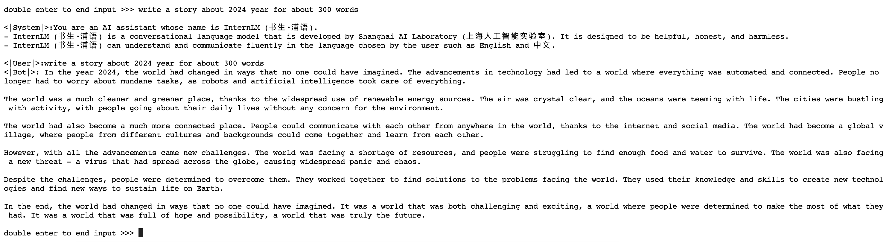
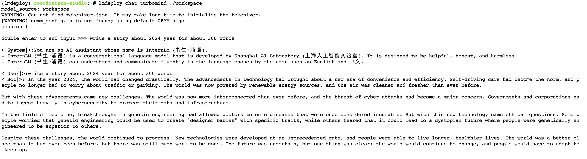

一、基础作业：
使用 LMDeploy 以本地对话、网页Gradio、API服务中的一种方式部署 InternLM-Chat-7B 模型，生成 300 字的小故事（需截图）

在线转换huggingface格式，本地启动：

TurboMind 推理+命令行本地对话：

TurboMind推理+API服务：

API请求结果：

网页 Demo 演示：Gradio直接和TurboMind 连接
